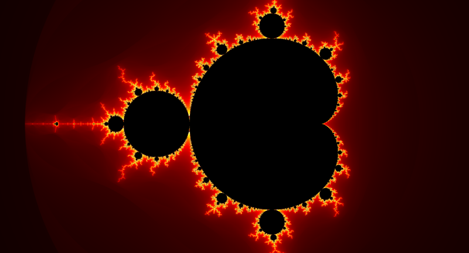
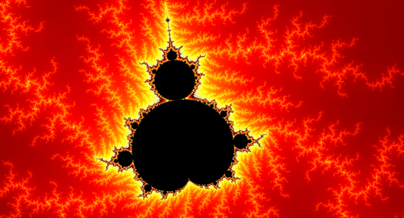
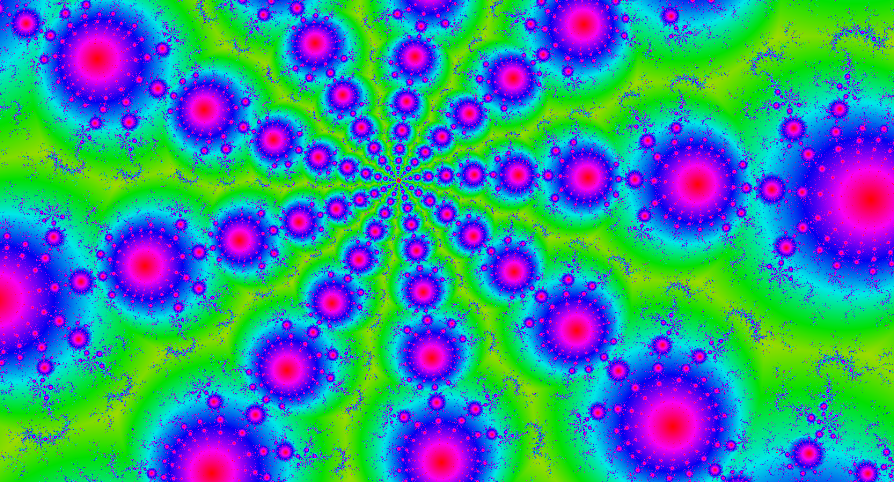

# Mandelbrot Fractal Viewer

This project displays and allows interactive exploration of the Mandelbrot set using Java Swing, with optional GPU acceleration through JOGL (Java OpenGL). It was designed to compare performance across single-threaded, multi-threaded, and GPU-based rendering modes, and provides an interactive interface for zooming, panning, and capturing fractal visualizations.

## Features

- Interactive zoom and pan functionality
- Three rendering modes:
    - **Escape Time**: Classic iteration count-based coloring
    - **Smooth Color**: Gradient-based coloring for smooth transitions
    - **Orbit Trap**: Alternate rendering based on proximity to trap points
- Three rendering backends:
    - **Single-threaded CPU**
    - **Multi-threaded CPU**
    - **GPU-accelerated OpenGL shader (JOGL)**
- Palette cycling and color shifting
- Screenshot export
- Runtime performance benchmarking (console-logged)

## Requirements

- Java 8 or higher
- JOGL libraries (included in project or dependencies)
- **OpenGL 4.0+ is required for the GPU rendering mode**

### ⚠ GPU Compatibility Note

If your system does not support OpenGL 4.0 or higher, the GPU rendering mode may fail silently or not display properly. While a backup shader exists, it is currently incomplete and not guaranteed to render correctly on unsupported systems. In this case, please use the single-threaded or multi-threaded CPU rendering modes.

## Running the Project

To launch the application:
1. Ensure JOGL and GlueGen native libraries are included in your project.
2. Run the `main()` method in the `MandelbrotViewer` class.

## Screenshots

## License

This project uses JOGL (Java OpenGL), licensed under the BSD 2-Clause License.  
See `LICENSE-jogl.txt` and `LICENSE-gluegen.txt` for details.
